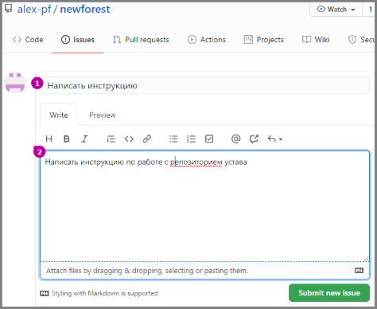
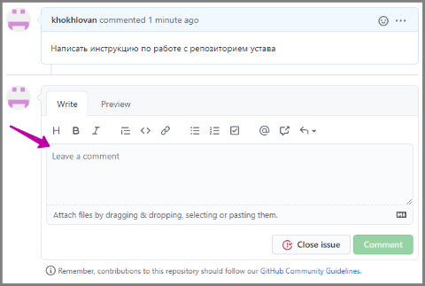

# Как работать с репозиторием устава

В инструкции рассмотрены два наиболее простых способа участия в разработке документа, не требующие знаний о том, как устроен git
Прежде всего, вам необходимо зарегистрироваться на https://github.com

### Адреса

Страница проекта: [github.com/users/alex-pf/projects/2](https://github.com/users/alex-pf/projects/2)

Тут расположена доска с заметкамо по ходу работы над проектом

Страница репозитория: [github.com/alex-pf/newforest](https://github.com/alex-pf/newforest)
Тут расположен сам проект,на главной странице можно увидеть его описание

## Добавление задач (Issues)

Задачи - это краткое описание, что нужно сделать. Например добавить в какой-то раздел устава пункт, или изменить его.
Для добавления задачи нужно:

1) перейти на страницу репозитория
2) перейти в раздел **Issues** 
3) нажать кнопку **New issues** (зелёная)

4) указать заголовок задачи и описание

5) нажать **Submit new issue**

Задача готова!

При желании к ней, как и к любой другой задаче, можно добавлять комментарии 

